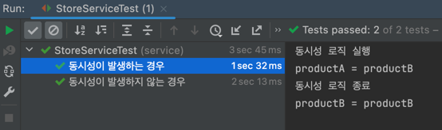
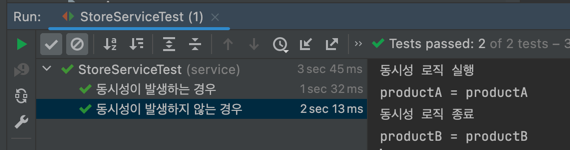
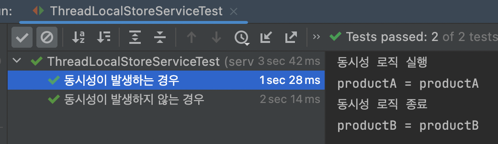
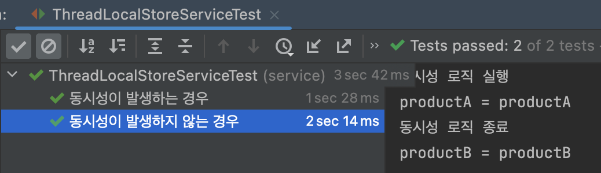

# 동시성 제어
## ThreadLocal
- ThreadLocal을 사용할 시 저장공간을 분리하여 동시성을 제어할 수 있다.

## 동시성 제어 테스트
### ThreadLocal을 사용하지 않았을 때
- 동시성이 발생하는 경우

- 동시성이 발생하지 않는 경우

### ThreadLocal을 사용 했을 때
- 동시성이 발생하는 경우

- 동시성이 발생하지 않는 경우

