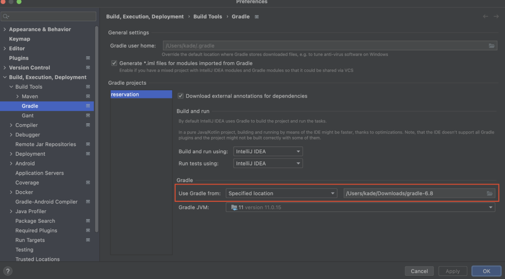

# Gradle 설정

1. Gradle 6.8 binary file download : [https://gradle.org/releases/ →](https://gradle.org/releases/) [https://gradle.org/next-steps/?version=6.8&format=bin](https://gradle.org/next-steps/?version=6.8&format=bin)
2. Intellij Preferences(command + ,) 열기
3. Gradle 설정

1. OK 버튼 클릭

** QueryDsl 설정을 했음에도 q class 파일 오류가 발생할 경우

→ queryDslOutput = file(”$buildDir/generated”) 로 정의를 하면 된다.