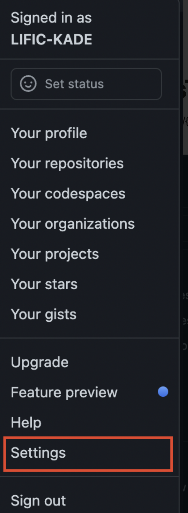
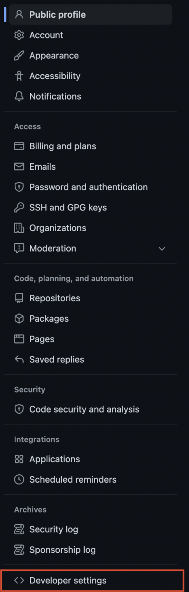
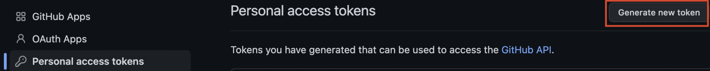
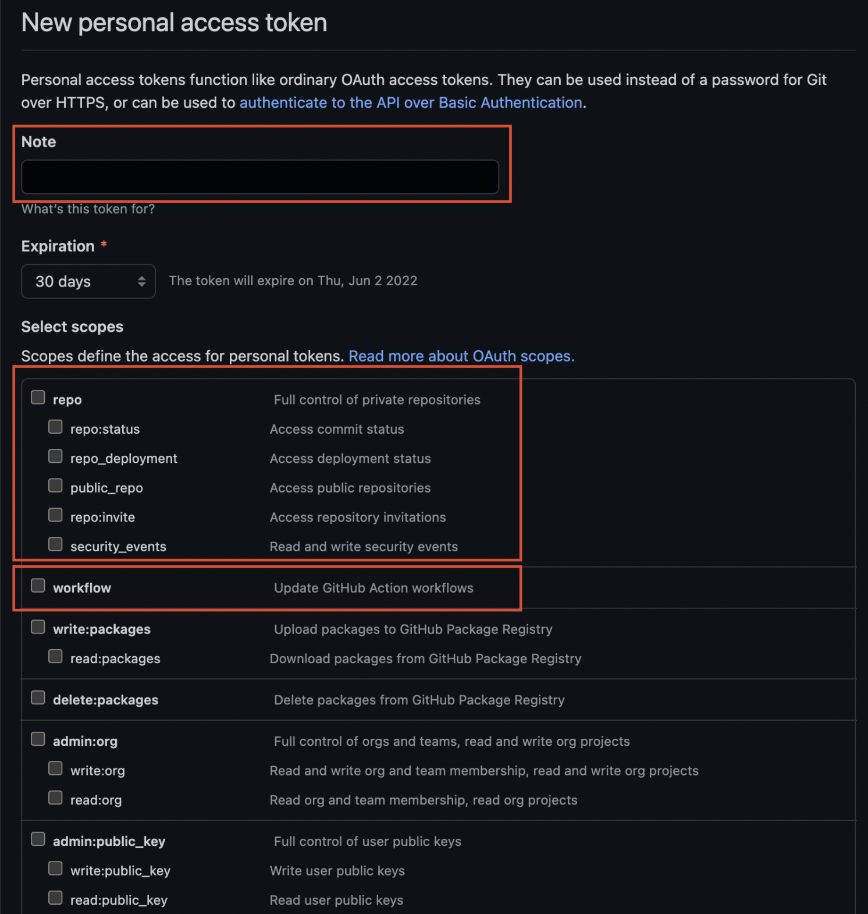
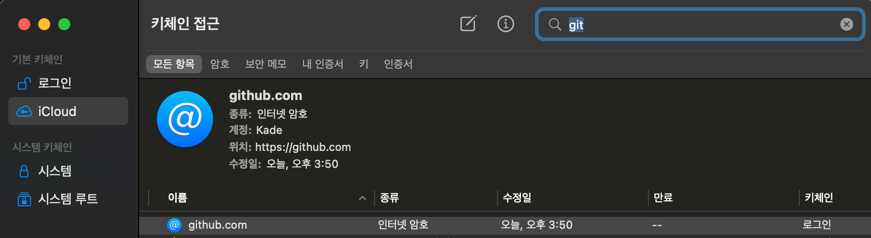
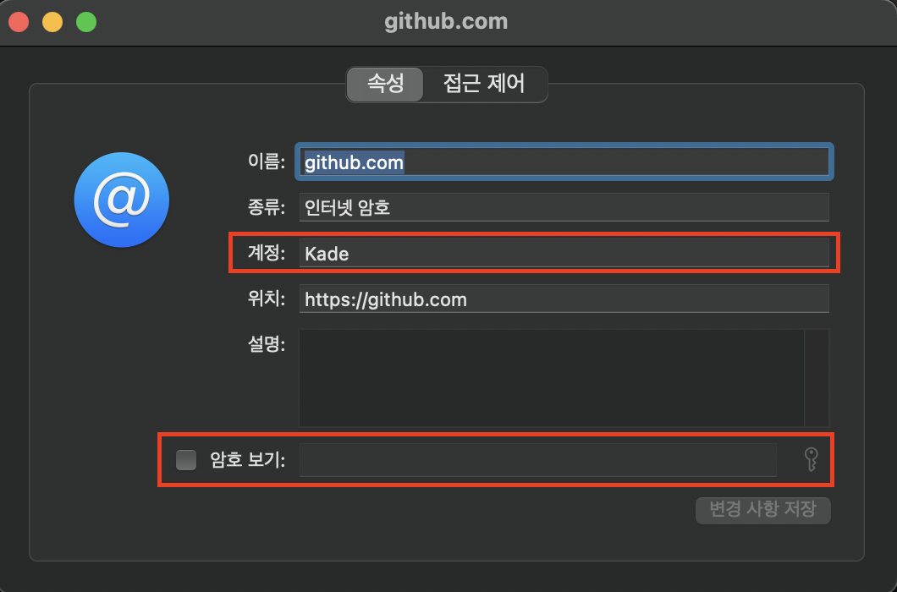
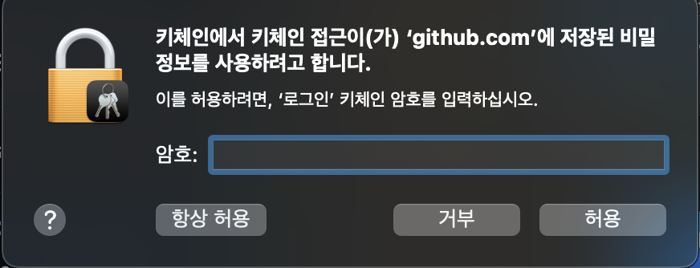
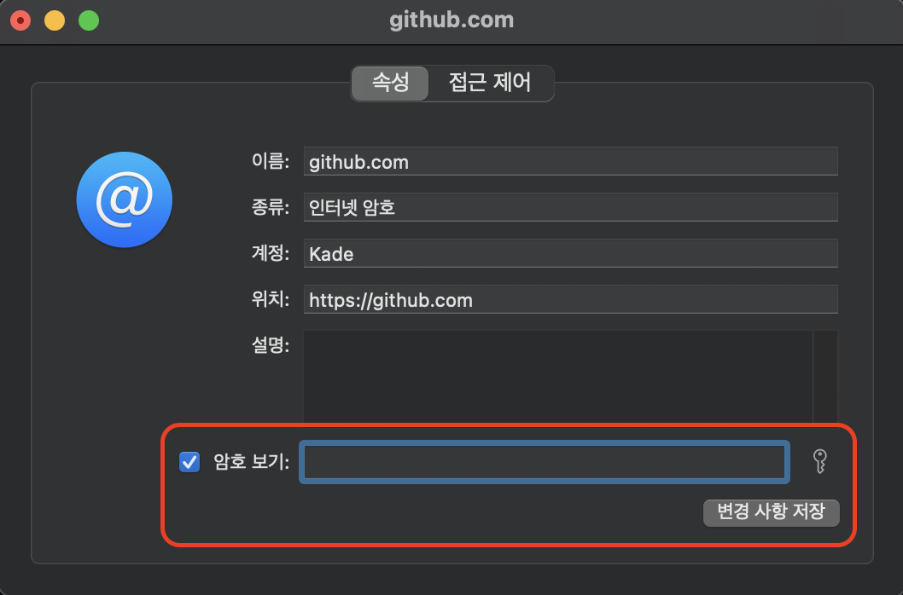

# Intellij Github AccessToken 설정

## 처음부터 다시 설정하는 방법
1. fatal: Authentication failed for 'https://github.com/{repository}/{repository}.git' 오류 발생 시
2. Github Login → Settings



3. Settings → Developer settings



4. Developer settings → Personal access tokens → Generate new token



5. New personal access token 설정



- Note (설명란)
- repo
- workflow
- 나머지는 repository, organization 등 어드민관련 제어권한이기 때문에 위 3가지만 필수적으로 선택하면 될 것으로 보임
1. Intellij 에서 git clone or push or pull 진행

```bash
Username for 'https://github.com' : 
Password for 'https://{username}@github.com' : {발급 토근 입력}
```

1. global 설정

```bash
git config --global user.name "{username}"
git config --global user.email "{email}"
git config --global credential.helper cache (Git memory에 password를 저장해두고 사용하기 위한 명령어)
```

## KeyChain 변경하는 방법
1. Github Login -> Settings

2. Settings -> Developer settings

3. Developer settings → Personal access tokens -> Regenerate
4. KeyCahin 설정
- 키체인 접근 창 열기

- Github 키체인 선택

- 계정 변경 및 암호 보기 선택

- 키체인 변경 후 저장

5. Remoete Git url 변경
```bash
git remote set-url origin {repository url}
```